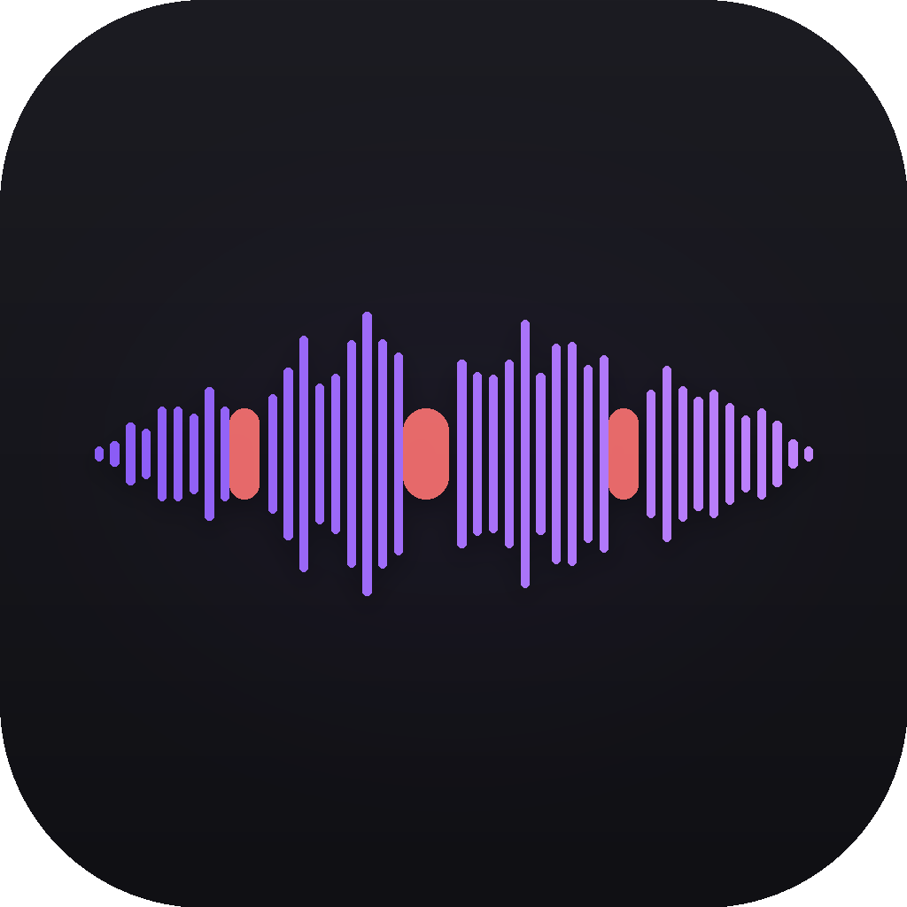

# Vocal Dropout Player



Train your inner voice. The app plays a song with the vocals and instrumental
on separate tracks, then drops the vocal out at random moments while the
music keeps going. Your mind fills in the missing voice — that act of
mental generation is the exercise. Because the timing is random, you can't
memorize the pattern


## Install

Download from [Releases](https://github.com/Zonnne/Vocal-Dropout-Player/releases):
`-arm64.dmg` for Apple Silicon, plain `.dmg` for Intel Macs, `Setup .exe` or
`-win.zip` for Windows.

The builds are unsigned, so the OS warns once. On macOS, right-click the app
and choose Open. On Windows, click "More info" then "Run anyway".

First launch downloads the audio engine (~2GB, once) in the background.
The first play of each song takes a moment to separate the vocal from the
instrumental; the result is cached, so every play after that is instant.

## Use

Drop a song onto the window. Press play. Adjust how long the vocal drops
(0.5–3s) and how often (per minute).

If you have a word-timed `.lrc` lyrics file, attach it from the song's
row and the app will mute whole words instead of random slices.

check [LDDC](https://github.com/chenmozhijin/LDDC) for generating word-by-word lyrics

## Develop

```bash
npm install && npm start     # run
npm test                     # test the dropout planners
./scripts/dist.sh            # package (mac arm64/intel, windows)
```
